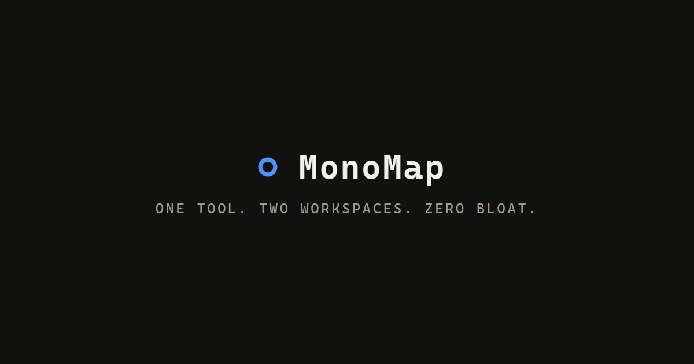

# MonoMap

One tool, two workspaces — a keyboard-first, local-first mind map **and** kanban board. Zero bloat.

MonoMap runs entirely in your browser. Maps and boards live on your device (IndexedDB) and work offline,
with no account or cloud required.



## Features

- **Mind map + Kanban** — a top-center `[🧠 Mind Map] [📋 Kanban]` switch (`Ctrl/Cmd + K`) flips between
  workspaces without reloading.
- **Infinite canvas** — pan and zoom (25–250%), drag nodes anywhere, world-anchored dotted background.
- **Speed-of-thought editing** — `Tab` to branch, `Enter` to continue, `Space` or a click/tap to edit,
  arrows to navigate, `Del` to delete. A `+` button on each node creates children too.
- **Right settings panel** — colors, emoji icons, hyperlinks, and notes per node.
- **Live Markdown split view** — type an outline on the left, watch the map build itself on the right
  (`Ctrl/Cmd + M`).
- **Kanban boards** — drag-and-drop cards and columns, labels, due dates, sub-task checklists, and instant
  filtering (`Ctrl/Cmd + F`).
- **Mind map ↔ board bridge** — send a node to a board as a card (children become checklist items), or
  generate an entire board from a branch; jump between a concept and its execution card in one click.
- **Organized workspace** — folders, multiple tabs (`Ctrl/Cmd + T` / `W`), drag-and-drop organization,
  inline rename (double-click).
- **Local-first** — autosaves to IndexedDB; export maps to `.md` / `.png`, back up the whole profile as
  `.json`, and import `.md` / `.txt` / profiles.

## Quick Start

```bash
npm install
npm run dev    # http://localhost:5173
```

`/` is the landing page, `/workspace` is the app.

## Scripts

```bash
npm run dev        # dev server
npm run build      # production build
npm run check      # svelte-check diagnostics
npm test           # unit tests
npm run test:e2e   # Playwright browser tests
```

## License / Contact

MonoMap is a product by **Tehnika**. Contact: [hello@tehnika.mk](mailto:hello@tehnika.mk) ·
[tehnika.mk](https://www.tehnika.mk)
